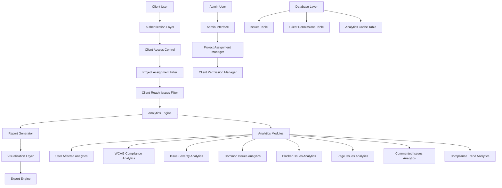
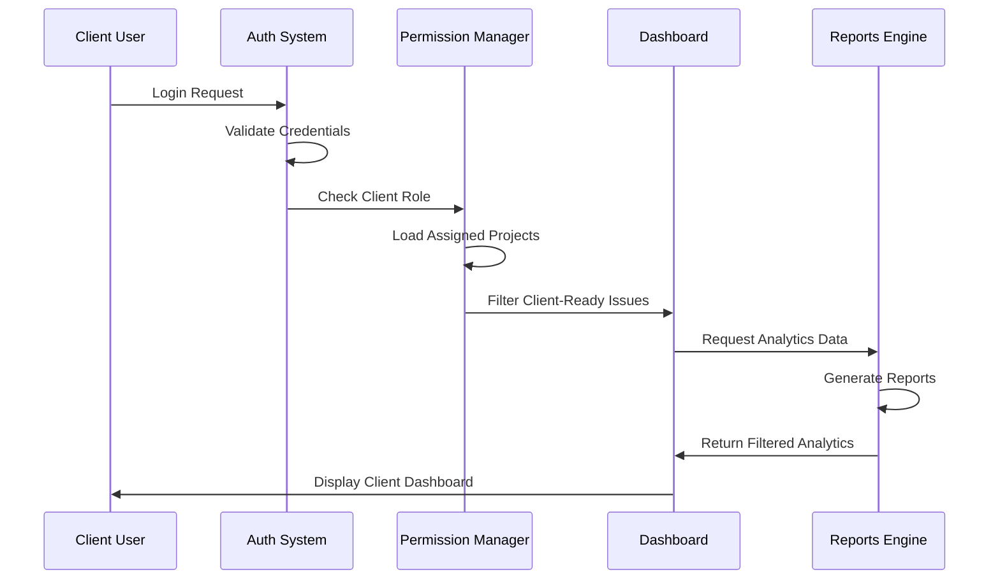
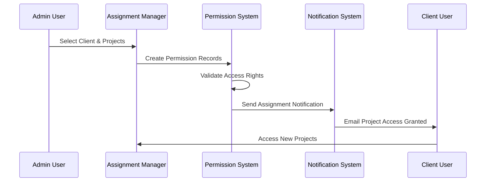

# Design Document: Client Reporting and Analytics System

## Overview

The Client Reporting and Analytics System extends the existing project management system to provide comprehensive reporting capabilities for client users. The system introduces a new client role with restricted access to only client-ready issues, enables admin assignment of projects to clients, and provides multiple display formats including individual project pages and unified dashboards. The system includes 9 core analytics reports with visualization capabilities and export functionality for PDF and Excel formats.

## Architecture



## Sequence Diagrams

### Client Login and Project Access Flow



### Admin Project Assignment Flow



## Components and Interfaces

### Component 1: Client Access Control Manager

**Purpose**: Manages client authentication and project access permissions

**Interface**:
```php
interface ClientAccessControlInterface {
    public function authenticateClient(string $username, string $password): ClientSession;
    public function getAssignedProjects(int $clientUserId): array;
    public function hasProjectAccess(int $clientUserId, int $projectId): bool;
    public function filterClientReadyIssues(array $issues): array;
}
```

**Responsibilities**:
- Authenticate client users with restricted permissions
- Validate project access based on admin assignments
- Filter issues to show only client_ready=1 items
- Maintain session security for client users

### Component 2: Analytics Engine

**Purpose**: Generates comprehensive analytics and reports for client consumption

**Interface**:
```php
interface AnalyticsEngineInterface {
    public function generateUserAffectedReport(array $projectIds): UserAffectedReport;
    public function generateWCAGComplianceReport(array $projectIds): WCAGComplianceReport;
    public function generateSeverityAnalysis(array $projectIds): SeverityAnalysisReport;
    public function generateCommonIssuesReport(array $projectIds): CommonIssuesReport;
    public function generateBlockerIssuesReport(array $projectIds): BlockerIssuesReport;
    public function generatePageIssuesReport(array $projectIds): PageIssuesReport;
    public function generateCommentedIssuesReport(array $projectIds): CommentedIssuesReport;
    public function generateComplianceTrendReport(array $projectIds, string $period): ComplianceTrendReport;
    public function generateUnifiedDashboard(array $projectIds): UnifiedDashboardReport;
}
```

**Responsibilities**:
- Process client-ready issues for analytics generation
- Calculate metrics across single or multiple projects
- Generate time-based trend analysis
- Provide data for visualization components
- Cache analytics results for performance

### Component 3: Visualization Layer

**Purpose**: Renders charts, graphs, and visual representations of analytics data

**Interface**:
```php
interface VisualizationInterface {
    public function renderPieChart(array $data, array $options): string;
    public function renderBarChart(array $data, array $options): string;
    public function renderLineChart(array $data, array $options): string;
    public function renderTable(array $data, array $columns): string;
    public function renderDashboardWidget(string $type, array $data): string;
}
```

**Responsibilities**:
- Generate interactive charts using Chart.js
- Render responsive tables with sorting/filtering
- Create dashboard widgets with real-time updates
- Ensure accessibility compliance for all visualizations

### Component 4: Export Engine

**Purpose**: Handles PDF and Excel export functionality for reports

**Interface**:
```php
interface ExportEngineInterface {
    public function exportToPDF(ReportInterface $report, array $options): string;
    public function exportToExcel(ReportInterface $report, array $options): string;
    public function generateReportHeader(array $projectInfo): array;
    public function formatDataForExport(array $data, string $format): array;
}
```

**Responsibilities**:
- Generate PDF reports with charts and tables
- Create Excel spreadsheets with multiple worksheets
- Include project metadata and branding
- Handle large datasets efficiently

### Component 5: Project Assignment Manager

**Purpose**: Manages admin assignment of projects to client users

**Interface**:
```php
interface ProjectAssignmentInterface {
    public function assignProjectsToClient(int $clientUserId, array $projectIds, int $adminUserId): bool;
    public function revokeProjectAccess(int $clientUserId, int $projectId, int $adminUserId): bool;
    public function getClientAssignments(int $clientUserId): array;
    public function getProjectClients(int $projectId): array;
    public function bulkAssignProjects(array $assignments): bool;
}
```

**Responsibilities**:
- Create and manage client-project assignments
- Validate admin permissions for assignments
- Send notification emails for access changes
- Maintain audit trail of assignment changes

## Data Models

### Model 1: ClientProjectAssignment

```php
interface ClientProjectAssignment {
    public int $id;
    public int $client_user_id;
    public int $project_id;
    public int $assigned_by_admin_id;
    public DateTime $assigned_at;
    public ?DateTime $expires_at;
    public bool $is_active;
    public ?string $notes;
    public DateTime $created_at;
    public DateTime $updated_at;
}
```

**Validation Rules**:
- client_user_id must exist in users table with role='client'
- project_id must exist in projects table
- assigned_by_admin_id must have admin privileges
- expires_at must be future date if specified

### Model 2: AnalyticsReport

```php
interface AnalyticsReport {
    public int $id;
    public string $report_type;
    public array $project_ids;
    public int $generated_by_user_id;
    public array $report_data;
    public array $chart_config;
    public DateTime $generated_at;
    public ?DateTime $expires_at;
    public string $cache_key;
}
```

**Validation Rules**:
- report_type must be one of predefined analytics types
- project_ids must be valid and accessible to user
- report_data must be valid JSON structure
- cache_key must be unique for caching strategy

### Model 3: ExportRequest

```php
interface ExportRequest {
    public int $id;
    public int $user_id;
    public string $export_type; // 'pdf' or 'excel'
    public string $report_type;
    public array $project_ids;
    public array $export_options;
    public string $status; // 'pending', 'processing', 'completed', 'failed'
    public ?string $file_path;
    public ?string $error_message;
    public DateTime $requested_at;
    public ?DateTime $completed_at;
}
```

**Validation Rules**:
- export_type must be 'pdf' or 'excel'
- status must follow defined workflow states
- file_path must be secure and within allowed directories
- export_options must contain valid configuration

## Algorithmic Pseudocode

### Main Analytics Processing Algorithm

```pascal
ALGORITHM generateClientAnalytics(clientUserId, projectIds, reportType)
INPUT: clientUserId of type Integer, projectIds of type Array, reportType of type String
OUTPUT: analyticsReport of type AnalyticsReport

BEGIN
  ASSERT clientUserId > 0 AND NOT EMPTY(projectIds) AND NOT EMPTY(reportType)
  
  // Step 1: Validate client access to projects
  accessibleProjects ← EMPTY_ARRAY
  FOR each projectId IN projectIds DO
    ASSERT hasProjectAccess(clientUserId, projectId) = true
    
    IF hasProjectAccess(clientUserId, projectId) THEN
      accessibleProjects.add(projectId)
    END IF
  END FOR
  
  ASSERT NOT EMPTY(accessibleProjects)
  
  // Step 2: Fetch client-ready issues with loop invariant
  clientReadyIssues ← EMPTY_ARRAY
  FOR each projectId IN accessibleProjects DO
    ASSERT allPreviousIssuesAreClientReady(clientReadyIssues)
    
    projectIssues ← fetchIssuesByProject(projectId, client_ready = 1)
    clientReadyIssues.addAll(projectIssues)
  END FOR
  
  // Step 3: Generate analytics based on report type
  analyticsData ← EMPTY_OBJECT
  
  CASE reportType OF
    "user_affected":
      analyticsData ← generateUserAffectedAnalytics(clientReadyIssues)
    "wcag_compliance":
      analyticsData ← generateWCAGAnalytics(clientReadyIssues)
    "severity_analysis":
      analyticsData ← generateSeverityAnalytics(clientReadyIssues)
    "common_issues":
      analyticsData ← generateCommonIssuesAnalytics(clientReadyIssues)
    "blocker_issues":
      analyticsData ← generateBlockerAnalytics(clientReadyIssues)
    "page_issues":
      analyticsData ← generatePageAnalytics(clientReadyIssues)
    "commented_issues":
      analyticsData ← generateCommentedAnalytics(clientReadyIssues)
    "compliance_trend":
      analyticsData ← generateTrendAnalytics(clientReadyIssues)
    DEFAULT:
      THROW InvalidReportTypeException
  END CASE
  
  // Step 4: Create and cache report
  report ← createAnalyticsReport(reportType, accessibleProjects, analyticsData)
  cacheReport(report)
  
  ASSERT report.isValid() AND report.hasData()
  
  RETURN report
END
```

**Preconditions:**
- clientUserId is a valid client user ID
- projectIds contains at least one valid project ID
- reportType is a supported analytics report type
- Client has access to at least one project in projectIds

**Postconditions:**
- Returns valid AnalyticsReport object with processed data
- Report contains only data from client-ready issues
- Report is cached for future requests
- All data is filtered according to client access permissions

**Loop Invariants:**
- All issues in clientReadyIssues have client_ready = 1
- All projects in accessibleProjects are accessible to the client
- Analytics data maintains consistency throughout processing

### Project Assignment Algorithm

```pascal
ALGORITHM assignProjectsToClient(adminUserId, clientUserId, projectIds)
INPUT: adminUserId of type Integer, clientUserId of type Integer, projectIds of type Array
OUTPUT: assignmentResult of type Boolean

BEGIN
  ASSERT adminUserId > 0 AND clientUserId > 0 AND NOT EMPTY(projectIds)
  
  // Step 1: Validate admin permissions
  IF NOT hasAdminRole(adminUserId) THEN
    THROW UnauthorizedAccessException
  END IF
  
  // Step 2: Validate client user exists and has client role
  clientUser ← getUserById(clientUserId)
  IF clientUser = NULL OR clientUser.role ≠ "client" THEN
    THROW InvalidClientUserException
  END IF
  
  // Step 3: Process each project assignment with transaction
  BEGIN_TRANSACTION
  
  successfulAssignments ← 0
  FOR each projectId IN projectIds DO
    ASSERT allPreviousAssignmentsAreValid()
    
    // Check if project exists and is accessible
    project ← getProjectById(projectId)
    IF project ≠ NULL AND canAdminAssignProject(adminUserId, projectId) THEN
      
      // Check if assignment already exists
      existingAssignment ← getClientProjectAssignment(clientUserId, projectId)
      
      IF existingAssignment = NULL THEN
        // Create new assignment
        assignment ← createClientProjectAssignment(
          clientUserId, projectId, adminUserId, NOW(), NULL, true
        )
        saveAssignment(assignment)
        successfulAssignments ← successfulAssignments + 1
      ELSE IF NOT existingAssignment.is_active THEN
        // Reactivate existing assignment
        existingAssignment.is_active ← true
        existingAssignment.assigned_by_admin_id ← adminUserId
        existingAssignment.assigned_at ← NOW()
        updateAssignment(existingAssignment)
        successfulAssignments ← successfulAssignments + 1
      END IF
      
      // Send notification email
      sendProjectAssignmentNotification(clientUserId, projectId, adminUserId)
    END IF
  END FOR
  
  IF successfulAssignments > 0 THEN
    COMMIT_TRANSACTION
    logAdminAction(adminUserId, "assign_projects", clientUserId, projectIds)
    RETURN true
  ELSE
    ROLLBACK_TRANSACTION
    RETURN false
  END IF
END
```

**Preconditions:**
- adminUserId has admin or super_admin role
- clientUserId exists and has client role
- projectIds contains valid project IDs
- Admin has permission to assign the specified projects

**Postconditions:**
- Client has access to successfully assigned projects
- Assignment records are created in database
- Notification emails are sent to client
- Admin action is logged for audit trail

**Loop Invariants:**
- All previous assignments in the loop are valid and saved
- Transaction maintains database consistency
- Notification system remains functional throughout processing

### Export Generation Algorithm

```pascal
ALGORITHM generateReportExport(userId, reportType, projectIds, exportFormat)
INPUT: userId of type Integer, reportType of type String, projectIds of type Array, exportFormat of type String
OUTPUT: exportFile of type ExportFile

BEGIN
  ASSERT userId > 0 AND NOT EMPTY(reportType) AND NOT EMPTY(projectIds) AND exportFormat IN ["pdf", "excel"]
  
  // Step 1: Generate analytics report
  analyticsReport ← generateClientAnalytics(userId, projectIds, reportType)
  
  // Step 2: Prepare export data
  exportData ← prepareExportData(analyticsReport)
  projectInfo ← getProjectsInfo(projectIds)
  
  // Step 3: Generate export based on format
  exportFile ← NULL
  
  IF exportFormat = "pdf" THEN
    exportFile ← generatePDFExport(exportData, projectInfo)
  ELSE IF exportFormat = "excel" THEN
    exportFile ← generateExcelExport(exportData, projectInfo)
  END IF
  
  ASSERT exportFile ≠ NULL AND exportFile.isValid()
  
  // Step 4: Save and return export file
  filePath ← saveExportFile(exportFile, userId)
  logExportGeneration(userId, reportType, exportFormat, filePath)
  
  RETURN exportFile
END
```

**Preconditions:**
- userId has valid client access to specified projects
- reportType is supported for export functionality
- exportFormat is either "pdf" or "excel"
- System has sufficient resources for export generation

**Postconditions:**
- Export file is generated successfully
- File is saved in secure location
- Export generation is logged for audit
- File is accessible to the requesting user

## Key Functions with Formal Specifications

### Function 1: hasProjectAccess()

```php
function hasProjectAccess(int $clientUserId, int $projectId): bool
```

**Preconditions:**
- `clientUserId` is a valid user ID with client role
- `projectId` is a valid project ID in the system
- Database connection is available and functional

**Postconditions:**
- Returns `true` if and only if client has active assignment to project
- Returns `false` if assignment doesn't exist or is inactive
- No side effects on database or user session

**Loop Invariants:** N/A (no loops in this function)

### Function 2: filterClientReadyIssues()

```php
function filterClientReadyIssues(array $issues): array
```

**Preconditions:**
- `issues` is an array of issue objects or arrays
- Each issue contains a `client_ready` field

**Postconditions:**
- Returns array containing only issues where `client_ready = 1`
- Original array is not modified
- Returned array maintains original issue structure

**Loop Invariants:**
- For filtering loops: All previously processed issues in result have `client_ready = 1`

### Function 3: generateAnalyticsCache()

```php
function generateAnalyticsCache(string $reportType, array $projectIds): string
```

**Preconditions:**
- `reportType` is a valid analytics report type
- `projectIds` is non-empty array of valid project IDs
- Cache system is available and functional

**Postconditions:**
- Returns unique cache key for the report configuration
- Cache key is deterministic for same inputs
- Cache key follows system naming conventions

**Loop Invariants:**
- For project ID processing: All processed IDs are valid integers

## Example Usage

```php
// Example 1: Client accessing assigned projects
$clientAccess = new ClientAccessControl($db);
$assignedProjects = $clientAccess->getAssignedProjects($clientUserId);

foreach ($assignedProjects as $project) {
    if ($clientAccess->hasProjectAccess($clientUserId, $project['id'])) {
        $analytics = $analyticsEngine->generateUserAffectedReport([$project['id']]);
        $visualization->renderPieChart($analytics->getData(), ['title' => 'User Affected Analysis']);
    }
}

// Example 2: Admin assigning projects to client
$assignmentManager = new ProjectAssignmentManager($db);
$projectIds = [101, 102, 103];
$success = $assignmentManager->assignProjectsToClient($clientUserId, $projectIds, $adminUserId);

if ($success) {
    $notification->sendAssignmentEmail($clientUserId, $projectIds);
}

// Example 3: Generating unified dashboard
$analytics = new AnalyticsEngine($db);
$unifiedReport = $analytics->generateUnifiedDashboard($assignedProjects);

$dashboard = [
    'userAffected' => $analytics->generateUserAffectedReport($assignedProjects),
    'wcagCompliance' => $analytics->generateWCAGComplianceReport($assignedProjects),
    'severityAnalysis' => $analytics->generateSeverityAnalysis($assignedProjects),
    'complianceTrend' => $analytics->generateComplianceTrendReport($assignedProjects, 'monthly')
];

// Example 4: Export functionality
$exportEngine = new ExportEngine();
$pdfFile = $exportEngine->exportToPDF($unifiedReport, [
    'includeCharts' => true,
    'includeMetadata' => true,
    'format' => 'A4'
]);

$excelFile = $exportEngine->exportToExcel($unifiedReport, [
    'multipleSheets' => true,
    'includeCharts' => true,
    'format' => 'xlsx'
]);
```

## Correctness Properties

*A property is a characteristic or behavior that should hold true across all valid executions of a system-essentially, a formal statement about what the system should do. Properties serve as the bridge between human-readable specifications and machine-verifiable correctness guarantees.*

### Property 1: Client Authentication and Role Validation

*For any* client user attempting system access, authentication should succeed if and only if they have valid credentials and client role permissions, with proper session management and security logging.

**Validates: Requirements 1.1, 1.2, 1.3, 1.4, 1.5**

### Property 2: Client-Ready Issue Filtering Consistency

*For any* system component displaying or processing issues, only issues marked with client_ready=1 should be visible to client users, ensuring consistent data isolation across all views and analytics.

**Validates: Requirements 3.1, 3.2, 3.3, 3.5**

### Property 3: Project Assignment Access Control

*For any* client user and project combination, access should be granted if and only if there exists an active assignment record created by an authorized admin, with proper audit trail and notification.

**Validates: Requirements 2.1, 2.2, 2.4, 2.5, 17.1, 17.2**

### Property 4: Analytics Calculation Accuracy

*For any* analytics report generation, calculations should be based exclusively on client-ready issues from assigned projects, with consistent aggregation logic across all report types including user affected, WCAG compliance, severity, and trend analysis.

**Validates: Requirements 4.1, 4.2, 4.4, 5.1, 5.2, 5.4, 6.1, 6.2, 6.4, 7.1, 7.2, 7.4, 8.1, 8.2, 8.4, 9.1, 9.2, 9.4, 10.1, 10.2, 10.4, 11.1, 11.2, 11.4**

### Property 5: Visualization Rendering Completeness

*For any* analytics data requiring visualization, the system should render interactive charts, tables, and widgets with proper accessibility compliance, responsive design, and appropriate handling of edge cases when data is unavailable.

**Validates: Requirements 4.3, 5.3, 6.3, 7.3, 8.3, 9.3, 10.3, 11.3, 12.2, 12.3, 13.3, 16.1, 16.2, 16.3, 16.4**

### Property 6: Dashboard and Project Page Integration

*For any* client user with assigned projects, the unified dashboard should aggregate data from all accessible projects while individual project pages should display filtered data for single projects, with consistent navigation and drill-down capabilities.

**Validates: Requirements 12.1, 12.4, 13.1, 13.2, 13.4, 13.5**

### Property 7: Export Generation Round-Trip Integrity

*For any* analytics report, both PDF and Excel exports should contain complete data representation including all charts, tables, metadata, and formatting, with secure file handling and support for multiple formats.

**Validates: Requirements 14.1, 14.2, 14.3, 14.4, 14.5, 15.1, 15.2, 15.3, 15.4, 15.5**

### Property 8: Notification System Reliability

*For any* project assignment or access change, appropriate email notifications should be sent to affected client users with professional formatting, respect for communication preferences, and reliable delivery.

**Validates: Requirements 2.3, 19.1, 19.2, 19.3, 19.4, 19.5**

### Property 9: Performance and Caching Optimization

*For any* analytics request, the system should deliver results within acceptable time limits using caching strategies, database optimization, and graceful fallback to real-time generation when cache is unavailable.

**Validates: Requirements 18.1, 18.2, 18.3, 18.4, 18.5**

### Property 10: Security and Audit Trail Completeness

*For any* client activity including login attempts, project access, report generation, and data exports, comprehensive audit logs should be maintained with proper security measures, retention policies, and administrative search capabilities.

**Validates: Requirements 17.3, 17.4, 17.5, 20.1, 20.2, 20.3, 20.4, 20.5**

## Error Handling

### Error Scenario 1: Unauthorized Project Access

**Condition**: Client attempts to access project not assigned to them
**Response**: Return 403 Forbidden with clear error message
**Recovery**: Redirect to assigned projects list with notification

### Error Scenario 2: Analytics Generation Failure

**Condition**: Database error or insufficient data for analytics
**Response**: Log error details and return cached data if available
**Recovery**: Display partial results with warning message, retry mechanism

### Error Scenario 3: Export Generation Timeout

**Condition**: Large dataset causes export process to exceed time limits
**Response**: Queue export for background processing
**Recovery**: Send email notification when export is ready for download

### Error Scenario 4: Invalid Client Assignment

**Condition**: Admin attempts to assign non-existent project or invalid client
**Response**: Validate inputs and return specific error messages
**Recovery**: Highlight invalid selections and provide correction guidance

## Testing Strategy

### Unit Testing Approach

Focus on testing individual components with comprehensive coverage of:
- Client access control functions with various permission scenarios
- Analytics calculation accuracy with known datasets
- Export generation with different formats and options
- Project assignment validation and error handling

Key test cases include boundary conditions, invalid inputs, and edge cases for each analytics report type.

### Property-Based Testing Approach

**Property Test Library**: PHPUnit with custom property generators

**Key Properties to Test**:
1. **Access Control Property**: Generate random client-project combinations and verify access rules
2. **Data Filtering Property**: Generate issue datasets and verify client_ready filtering
3. **Analytics Consistency Property**: Generate project data and verify analytics calculations
4. **Export Integrity Property**: Generate reports and verify export completeness

### Integration Testing Approach

Test complete workflows including:
- End-to-end client login and dashboard access
- Admin project assignment and client notification flow
- Analytics generation across multiple projects
- Export generation and download functionality
- Database transaction integrity during bulk operations

## Performance Considerations

**Caching Strategy**: Implement Redis-based caching for analytics results with TTL based on data volatility. Cache keys include project IDs and report types for efficient invalidation.

**Database Optimization**: Add composite indexes on (client_ready, project_id) and (user_id, project_id, is_active) for fast filtering. Implement query optimization for large datasets.

**Export Performance**: Use background job processing for large exports with progress tracking. Implement streaming for Excel generation to handle memory constraints.

**Scalability**: Design analytics engine to support horizontal scaling with project-based data partitioning. Implement connection pooling for concurrent client access.

## Security Considerations

**Access Control**: Implement role-based access control with project-level permissions. All client access must be validated against active assignments with expiration checking.

**Data Isolation**: Ensure complete data isolation between clients with no cross-client data leakage. Implement query-level filtering for all database operations.

**Export Security**: Generate exports in secure temporary directories with user-specific access. Implement automatic cleanup of export files after download or expiration.

**Audit Logging**: Maintain comprehensive audit trails for all admin actions, client access, and data exports. Include IP addresses, timestamps, and action details.

**Input Validation**: Validate all user inputs including project IDs, report parameters, and export options. Implement SQL injection prevention and XSS protection.

## Dependencies

**Core Dependencies**:
- PHP 8.1+ with PDO extension for database operations
- MySQL 8.0+ for data storage with JSON column support
- Redis 6.0+ for caching and session management

**Frontend Dependencies**:
- Chart.js 3.9+ for interactive visualizations
- Bootstrap 5.1+ for responsive UI components
- jQuery 3.6+ for DOM manipulation and AJAX

**Export Dependencies**:
- TCPDF 6.4+ for PDF generation with chart support
- PhpSpreadsheet 1.24+ for Excel export functionality
- Intervention Image 2.7+ for chart image generation

**Email Dependencies**:
- PHPMailer 6.6+ for notification emails
- SMTP server configuration for reliable delivery

**Development Dependencies**:
- PHPUnit 9.5+ for unit and integration testing
- Composer for dependency management
- Node.js 16+ for frontend asset compilation